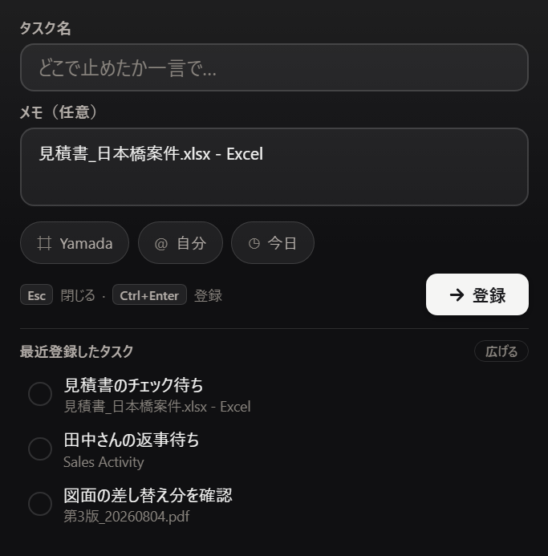

# Click Up Widget

作業を中断するとき、「どこで止めたか・次どこから再開するか」を ClickUp に
ワンタッチで残せる Windows 常駐ツール。

`Ctrl + Shift + Space` を押すと画面の右下に小さな入力窓が出る。タスク名とメモを入れて
`Ctrl + Enter` で ClickUp にタスクが登録される。



## できること

- **すぐ書ける** — ホットキーひとつ。前に開いていたウィンドウの名前がメモ欄に下書きとして入る
- **登録先を選べる** — リスト・担当者・期限をその場で切り替えられる（触らなければいつもの場所へ）
- **よく使うものを覚える** — 候補に ★ を付けると次から上に出る
- **見失わない** — 最近登録したものを一覧で表示。広げると期限切れ・今日・今週で切り替えられる
- **切れていても書ける** — ネットが無いときは手元に預かり、つながり次第まとめて登録する
- **鍵を守る** — ClickUp のトークンは Windows の DPAPI で暗号化して保存する（他のパソコンでは読めない）

くわしい使い方は [取扱説明書](取扱説明書.html) を参照（画面写真つき）。

## 動かすもの

| | |
|---|---|
| OS | Windows 10 / 11 |
| 必要なアカウント | ClickUp（無料プランで動く） |
| 同梱するもの | Python + PyQt6 + MinGit（利用者は何もインストールしなくてよい） |

配布物は署名済みのバイナリだけで構成してある。Windows 11 の Smart App Control は
署名も実績も無い実行ファイルを問答無用で弾くため、自前でビルドした exe は使わない。

## 開発

```
app/                本体。ここが配布物の app/ にそのまま入る
manual/             取扱説明書のもと（template.html + 画面写真）
build.py            配布物の組み立て
設定を解除するとき/  自動起動を外すための .bat
```

```powershell
# 動かす
pythonw app\pause.pyw

# 説明書の画面写真を撮り直す
python manual\take_shots.py

# 配布物を作る（dist\ClickUpWidget配布版.zip）
python build.py
```

`runtime/`（Python + Qt）と `mingit/`（Git）は 500MB を超えるので Git に入れていない。
`build.py` が用意する。

## Git に入れないもの

利用者ごとのデータ（`app/config.json` `app/directory.json` `app/outbox.json` とログ）は
`.gitignore` で外してある。**接続情報や社内の案件名・メールアドレスが入るため、
コミットする前に `git status` で確認すること。**

<!-- smoke: 更新の動作確認 -->
